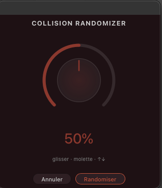

# Soulreaktive — CollisionRandomizer

I always wish Ableton would add a random clickable button to their Instruments & Fx devices (not when they are racked), now it's possible with this 'lil extension. This is another cool starting point, when you find something sounding good, you can go further in sound designing Collision, or simply save this state as a new preset.

You can choose a percentage of randomness from 0 to 100%. Initial start is 50%.

## Installation

Double-click the `.ablx` file with Live Beta open (Developer Mode enabled in Preferences → Extensions).

## Usage

Right-click on a MIDI track (clip view or arrangement view) containing a Collision → search in extension menu: ***Soulreaktive - CollisionRandomizer*** → Start Randomize Collision

## What gets randomized

- Resonator 1 and 2 — 75% chance of being ON each (at least one always active)
- Resonator parameters: Type, Quality, Material, Radius, Brightness, Inharmonics, Decay, Opening, Hit, Bleed, Pan, Volume, Pitch Envelope
- Mallet — 75% chance of being ON (Stiffness, Noise Amount, Noise Color, Volume)
- Noise oscillator — 30% chance of being ON (Filter Type, Freq, Q, Envelope)
- LFO 1 and 2 — 60% chance of being ON each (Shape, Rate, Depth, Destinations)
- Modulation matrix (Pitch Bend, Mod Wheel, Pressure, Slide destinations and amounts)

## What stays locked

- Volume — forced to -12dB
- Res 1 and Res 2 Tune — untouched (±48 semitones too risky)
- Res 1 and Res 2 Fine Tune — untouched
- Device On — always ON
- At least one resonator always active
